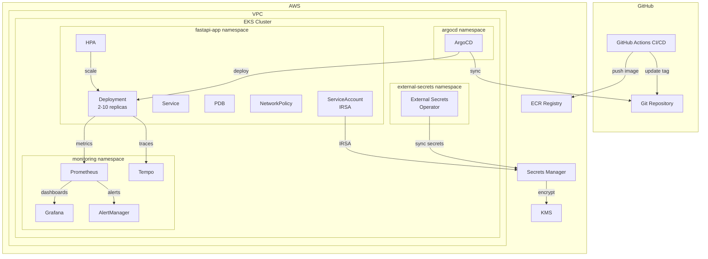

# 🚀 Production-Ready FastAPI Service

A platform engineering take on making a simple FastAPI service production-ready for AWS/EKS. This repository demonstrates the full lifecycle: application hardening, containerization, Kubernetes packaging, infrastructure as code, CI/CD, observability, GitOps, and operational documentation.

## 📋 Table of Contents

- [Problem Statement](#problem-statement)
- [Architecture](#architecture)
- [Repository Structure](#repository-structure)
- [Quick Start](#quick-start)
- [What "Production-Ready" Means](#what-production-ready-means)
- [Key Decisions](#key-decisions)
- [SLO/SLI Definitions](#slosli-definitions)
- [What I'd Do With More Time](#what-id-do-with-more-time)

---

## Problem Statement

A product team handed us a Python FastAPI app with two endpoints:
- `/health` — simple health check
- `/process` — **business-critical** endpoint with random latency (50-400ms) and a 5% failure rate

**Requirements:**
- Zero tolerance for silent failures on `/process`
- Must run on AWS/EKS infrastructure
- Platform team of 3 — solutions must be operationally feasible

**Constraints:**
- No real AWS account — uses dry-run outputs and stubs
- Must demonstrate production-grade patterns, not just toy examples

---

## Architecture



---

## Repository Structure

```
.
├── app/                          # Application code
│   ├── app.py                    # Hardened FastAPI service
│   ├── requirements.txt          # Pinned Python dependencies
│   ├── Dockerfile                # Multi-stage, security-hardened
│   ├── .dockerignore
│   └── tests/
│       └── test_app.py           # Unit tests (>80% coverage)
│
├── helm/fastapi-app/             # Helm chart
│   ├── Chart.yaml
│   ├── values.yaml               # Production defaults
│   └── templates/
│       ├── deployment.yaml       # SecurityContext, probes, topology spread
│       ├── service.yaml
│       ├── serviceaccount.yaml   # automountServiceAccountToken: false
│       ├── hpa.yaml              # 2-10 replicas, CPU/memory targets
│       ├── pdb.yaml              # minAvailable: 1
│       ├── networkpolicy.yaml    # Ingress/egress restrictions
│       ├── servicemonitor.yaml   # Prometheus Operator
│       ├── prometheusrule.yaml   # SLO-based alerts
│       ├── external-secret.yaml  # ESO integration
│       └── secretstore.yaml      # AWS Secrets Manager via IRSA
│
├── terraform/                    # Infrastructure as Code
│   ├── main.tf                   # Root module
│   ├── variables.tf
│   ├── modules/
│   │   ├── vpc/                  # VPC + subnets + NAT + flow logs
│   │   ├── eks/                  # EKS + node groups + OIDC/IRSA
│   │   ├── ecr/                  # Image registry + lifecycle policies
│   │   └── secrets/              # Secrets Manager + KMS + IRSA
│   └── environments/
│       └── dev/                  # Per-environment tfvars
│
├── monitoring/
│   ├── dashboards/
│   │   └── fastapi-app.json      # Grafana dashboard (RED method)
│   └── tracing/
│       └── tempo-config.yaml     # Tempo distributed tracing config
│
├── gitops/argocd/                # GitOps
│   ├── application.yaml          # ArgoCD Application (auto-sync + self-heal)
│   └── project.yaml              # AppProject with least-privilege scope
│
├── .github/workflows/
│   ├── ci.yaml                   # Lint → Test → Build → Scan → Deploy
│   └── terraform.yaml            # Terraform fmt → validate → plan
│
├── docs/
│   ├── adr/                      # Architecture Decision Records
│   │   ├── 001-helm-over-raw-manifests.md
│   │   ├── 002-structured-logging.md
│   │   ├── 003-slo-based-alerting.md
│   │   └── 004-gitops-with-argocd.md
│   └── runbook.md                # Incident response runbook
│
└── README.md                     # ← You are here
```

---

## Quick Start

### Local Development

```bash
# Build the container
cd app
docker build -t fastapi-app:local .

# Run locally
docker run --rm -p 8080:8000 fastapi-app:local

# Test endpoints
curl http://localhost:8080/health      # {"status":"ok"}
curl http://localhost:8080/ready       # {"status":"ready"}
curl http://localhost:8080/process     # {"result":"done"} (or 500)
curl http://localhost:8080/metrics     # Prometheus metrics
```

### Run Tests

```bash
cd app
pip install -r requirements.txt
pip install pytest pytest-cov httpx
pytest tests/ -v --cov=. --cov-report=term-missing
```

### Validate Helm Chart

```bash
helm lint helm/fastapi-app/
helm template test-release helm/fastapi-app/
```

### Validate Terraform

```bash
cd terraform
terraform init -backend=false
terraform validate
```

---

## What "Production-Ready" Means

For a 3-person platform team, production-ready means **high confidence with low operational burden**. Every decision below was filtered through: *"Can three people maintain this at 2 AM?"*

### 1. No Silent Failures (Zero Tolerance)
- ✅ `/process` errors return HTTP 500 instead of unhandled exceptions
- ✅ Every error is logged with structured JSON and a correlation ID
- ✅ Custom Prometheus counters track error rate and latency
- ✅ SLO-based alerts fire when `/process` error rate exceeds 1%
- ✅ Distributed traces via Tempo show request flow end-to-end
- ✅ Grafana dashboard provides real-time visibility

### 2. Resilient Deployment
- ✅ Minimum 2 replicas with HPA (scales to 10)
- ✅ PDB ensures at least 1 pod survives voluntary disruptions
- ✅ Rolling updates with `maxUnavailable: 0`
- ✅ Topology spread across AZs
- ✅ Startup/liveness/readiness probes

### 3. Security Hardened
- ✅ Non-root container, read-only filesystem, all capabilities dropped
- ✅ NetworkPolicy restricts traffic to ingress + monitoring namespaces only
- ✅ ServiceAccount with `automountServiceAccountToken: false`
- ✅ IRSA for AWS API access (no static credentials)
- ✅ ECR image scanning on push
- ✅ Trivy + Checkov in CI pipeline
- ✅ External Secrets Operator for secrets management

### 4. Fully Automated
- ✅ CI/CD: push to main → lint → test → build → scan → deploy
- ✅ GitOps: ArgoCD auto-sync with self-heal and pruning
- ✅ Terraform: infrastructure changes via PR review with plan output

---

## Key Decisions

| Decision | Why |
|---|---|
| **Helm** over raw manifests | Template reuse, values overrides, versioned releases, ecosystem support |
| **ArgoCD** for GitOps | Git as single source of truth, auto-sync with self-heal, audit trail |
| **Structured logging** (structlog) | Machine-parseable, correlation IDs, grep-friendly in CloudWatch/Loki |
| **OpenTelemetry + Tempo** | Vendor-neutral tracing, end-to-end request visibility, Grafana-native |
| **SLO-based alerting** | Actionable alerts tied to business impact, not arbitrary thresholds |
| **External Secrets Operator** | Native K8s secrets from AWS Secrets Manager, no static credentials |
| **Single NAT Gateway** | Cost optimization; for production HA, deploy one per AZ |
| **prometheus-client** (manual) | Lightweight, custom business metrics, no heavy auto-instrumentation overhead |

See [docs/adr/](docs/adr/) for detailed Architecture Decision Records.

---

## SLO/SLI Definitions

Since `/process` is business-critical, we define explicit SLOs:

| SLI | Target SLO | Measurement |
|---|---|---|
| Availability | 99.9% (43.8 min/month error budget) | `1 - (5xx_requests / total_requests)` |
| Latency (p99) | < 400ms | `histogram_quantile(0.99, process_duration_seconds)` |
| Error Rate | < 1% | `process_requests_total{status="error"} / process_requests_total` |

> **Note:** The app's inherent 5% failure rate means the error SLO will fire immediately. This is intentional — it signals that the product team needs to fix the underlying reliability, and the platform provides the visibility to detect it.

---

## What I'd Do With More Time

| Area | Next Steps |
|---|---|
| **Ingress + TLS** | AWS ALB Ingress Controller + ACM certificate, rate limiting |
| **Multi-env promotion** | dev → staging → production pipeline with ArgoCD ApplicationSets |
| **Canary deploys** | Argo Rollouts with automated analysis using Prometheus metrics |
| **Log aggregation** | Loki + Promtail for centralized log querying alongside traces |
| **Cost optimization** | Spot instances, Karpenter for intelligent node scaling |
| **Chaos engineering** | LitmusChaos to validate PDB and HPA behavior under failure |
| **API documentation** | Re-enable Swagger UI behind auth for non-prod environments |
| **Load testing** | k6 scripts to validate performance under realistic traffic |
| **Compliance** | OPA/Gatekeeper policies for pod security standards enforcement |

---

## Interview Discussion Topics

This repo is designed to spark discussion around:

1. **Trade-offs**: Why these tools over alternatives? (e.g., why not Istio?)
2. **3-person team fit**: Every tool adds operational cost — what's the right balance?
3. **Alert design**: The 1% error threshold vs. 5% failure rate — intentional tension
4. **Observability pyramid**: Metrics → Logs → Traces and when each matters
5. **Security layers**: Container → Pod → Network → IAM → Secrets
6. **GitOps workflow**: How changes flow from PR to production
7. **Scaling strategy**: HPA tuning, scale-down stabilization, PDB interaction

---

## License

MIT
